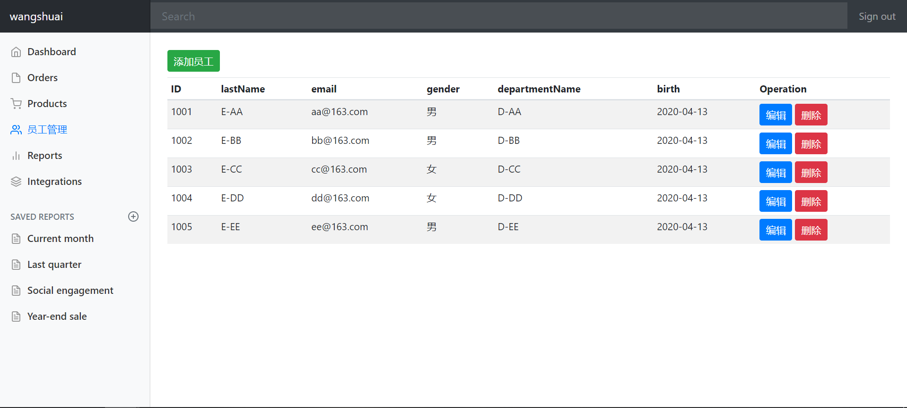

# SpringBoot-CRUD成果展示

### 1.功能概述

- 公网IP访问
- SpringBoot框架部署于Linux服务器
- 员工管理功能：支持增-删-改-查操作
- 支持国家化功能：中文-英文切换
- 支持登录权限管理：拦截器机制
- 已完善：错误处理机制
- 其他功能：todo……

### 2.访问方式

- Chrome浏览器：[登录网址](http://106.13.207.208:8081/crud/)
- 用户名：任意设置（不为空）
- 密码：wangshuai

### 3.效果展示

- 登录界面

  

- 统计分析

  

- 员工管理——微人事功能

  