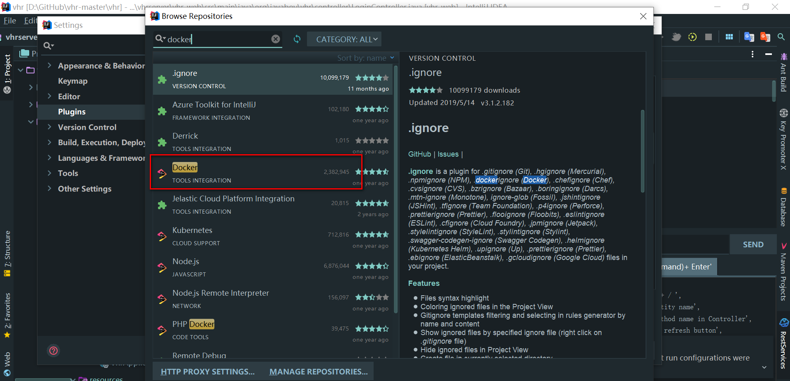
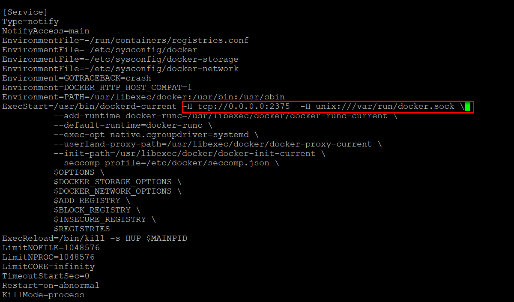
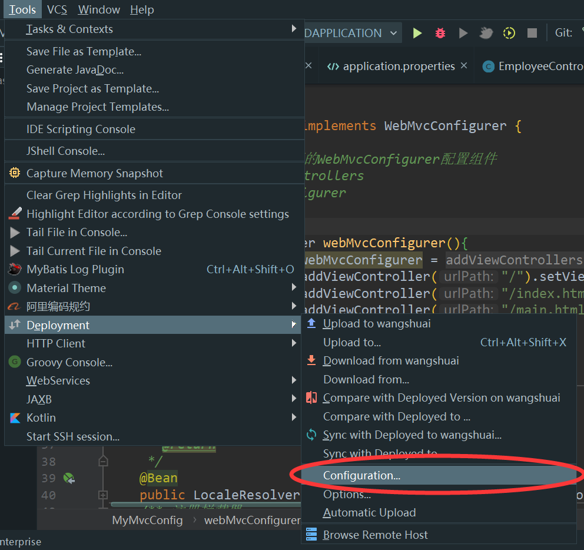
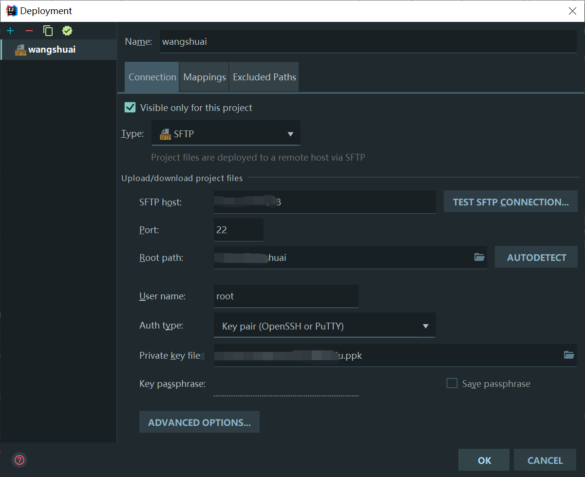
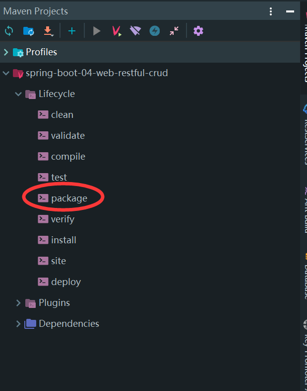
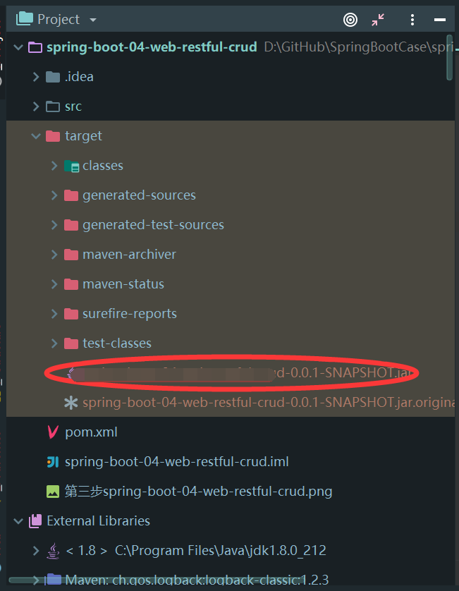

# [超简单]部署SpringBoot项目到Linux几种姿势

## 1.概述

- 不同于传统的单体应用，微服务由于服务数量众多，在部署的时候出问题的可能性更大，这个时候，结合 Docker 来部署，就可以很好的解决这个问题，这也是目前使用较多的方案之一。
- 但是docker插件安装出错的小伙伴，还是回归 Spring Boot 部署 jar 包的方式。
- 本文整合了多种部署姿势，以供参考。


## 2.docker插件方式

- [部署 Spring Boot 到远程 Docker 容器](https://blog.csdn.net/u012702547/article/details/100153799)
- 考虑TLS 安全连接[Docker Daemon 连接方式详解](https://www.jianshu.com/p/7ba1a93e6de4)
- [linux下常用命令查看端口占用](https://blog.csdn.net/ws379374000/article/details/74218530)

### 2.1准备工作

#### 下载安装IDEA插件

- 插件安装方式：File→Settings→BROWSE REPOSITORIES→搜索Docker→安装、重启IDEA。即可

  

#### 配置linux服务器Docker

- 首先，登录Linux服务器

  ```shell
  vim /usr/lib/systemd/system/docker.service
  ```

- 其次，开启Docker 2375端口

  - 一般默认`tcp://localhost:2375`

  

  ```shell
  按键：ESC
  输入
  :wq #保存退出
  ```

- 最后，重启Docker

  ```shell
  systemctl daemon-reload    
  service docker restart 
  ```

### 2.2配置 Dockerfile

- 在项目根目录创建 Dockerfile，脚本内容如下：

  ```shell
  FROM hub.c.163.com/library/java:latest #网易提供的 Docker 镜像
  VOLUME /tmp #Spring Boot 运行时需要 tmp 目录
  ADD target/docker-0.0.1-SNAPSHOT.jar app.jar #将本地 target 目录中打包好的 .jar 文件复制一份新的 到 /app.jar
  ENTRYPOINT ["java","-jar","/app.jar"] #/app.jar：项目打jar包名称
  ```

- 在pom.xml文件中，添加如下插件：

  ```xml
  <plugin>
      <groupId>com.spotify</groupId>
      <artifactId>docker-maven-plugin</artifactId>
      <version>1.2.0</version>
      <executions>
          <execution>
              <id>build-image</id>
              <phase>package</phase>
              <goals>
                  <goal>build</goal>
              </goals>
          </execution>
      </executions>
      <configuration>
          <dockerHost>http://192.168.66.131:2375</dockerHost>
          <imageName>javaboy/${project.artifactId}</imageName>
          <imageTags>
              <imageTag>${project.version}</imageTag>
          </imageTags>
          <forceTags>true</forceTags>
          <dockerDirectory>${project.basedir}</dockerDirectory>
          <resources>
              <resource>
                  <targetPath>/</targetPath>
                  <directory>${project.build.directory}</directory>
                  <include>${project.build.finalName}.jar</include>
              </resource>
          </resources>
      </configuration>
  </plugin>
  ```

### 2.3打包运行

- 利用maven工具打包，项目会自动构建成一个镜像，并且上传到 Docker 容器中。

### 2.4总结

- 通过 **Docker 插件** 还可以可视化查看 **容器** 的 **日志** 、 **环境变量** 、 **端口映射** 、 **数据卷** 等配置信息，并且可以动态 **修改配置** 和 **进入容器** ，比起 **敲命令** 方便的不要太多。

## 3.IDEA官方部署方法

### 3.1修改IDEA配置

- Tools→Deployment→Configration
- Configration中填写的参数说明：
  - 协议自由选择
  - 直接填写主机IP
  - 端口号一般默认开通22
  - RootPath是服务器完整路径
  - 用户名与密码可以选择安全密钥的方式登录服务器





### 3.2Maven工具打包



### 3.3上传服务器

- 右键jar包，deployment→upload to 文件夹名，上传服务器

  

### 3.4服务器运行jar包

```shell
#进入目标目录
java -jar jar包名称
# 后台不间断运行
nohup java -jar 名称.jar
```

## 4.常规方式

### 4.1思路1

- 使用ftp工具将jar包直接上传至服务器，再运行jar包
- 该方式有IDEA官方部署方式类似

### 4.2思路2

- 不使用jar包，而是利用war包的方式运行项目