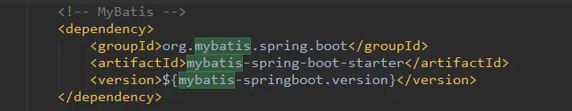

# 调试法-分析SpringBoot启动流程

## SpringBoot启动原理

##### 启动原理好文与好图

- [SpringBoot 应用程序启动过程探秘](https://juejin.im/post/5b8f05a5f265da43296c6102#heading-0)

  

- [SpringBoot启动流程解析](https://www.jianshu.com/p/87f101d8ec41)

  

### 1.调试准备

#### 为SpringBoot主程序打断点

```java
public static void main(String[] args) {
        SpringApplication.run(Springboot07StarterAnalyseApplication.class, args);//断点
    }
```

- run两个实参分别是：

  - 主要资源（primarySource）：Springboot07StarterAnalyseApplication.class
  - 命令行参数：String... args

- run方法体`(new SpringApplication(primarySources)).run(args)`作用是：

  1. 创建一个Spring应用程序实例(new SpringApplication(primarySources)).run(args);
  2. 运行这个Spring应用程序实例

  **并返回**

- 返回值是：**可配置的APP容器/上下文**（ConfigurableApplicationContext）——留个影像

### 2.SpringAPP.run（主程序类）的作用

全限定类名：`org\springframework\boot\spring-boot\2.2.6.RELEASE\spring-boot-2.2.6.RELEASE.jar!\org\springframework\boot\SpringApplication.class`


#### **首先、给予结论**：

##### **1.new SpringApplication(主程序类)**

- 判断是否web应用
- 加载并保存所有ApplicationContextInitializer（META-INF/spring.factories），
- 加载并保存所有ApplicationListener
- 获取到主程序类

##### **2.run()**

- 回调所有的SpringApplicationRunListener（META-INF/spring.factories）的starting
- 获取ApplicationArguments
- 准备环境&回调所有监听器（SpringApplicationRunListener ）的environmentPrepared
- 打印banner信息
- 创建ioc容器对象
  - AnnotationConfigEmbeddedWebApplicationContext（web 容器环境）
  - AnnotationConfigApplicationContext（普通环境容器）

##### 3.回调机制在此应用非常多

- 回调机制最详细的解释：[回调函数（callback）是什么？](https://www.zhihu.com/question/19801131)

### 3.分析 new主程序类

> SpringApplication本文统称为SpringAPP
>
> 本文常用调试功能
>
> - resume：直接跳到下一个断点
> - Step into（F7）：步入
> - Step over（F8）：步过
> - Step out（shit+F8）：步出
> - Frames：调试帧
> - DropFrames：删除一帧
> - Watch：特别关注的变量会添加监视（如各种被观察者、观察者），右击变量
>
> 

#### 1.下载source file

**原始.class文件**


**下载source file**：SpringApplication.java文件


#### 2.执行基本初始化

```java
执行.java的this.resourceLoader = resourceLoader;之前会进行一系列初始化操作
相当于：
.class的
this.sources = new LinkedHashSet();
this.bannerMode = Mode.CONSOLE;
this.logStartupInfo = true;
this.addCommandLineProperties = true;
this.addConversionService = true;
this.headless = true;
this.registerShutdownHook = true;
this.additionalProfiles = new HashSet();
this.isCustomEnvironment = false;
this.lazyInitialization = false;
之前的操作
this.resourceLoader = resourceLoader;
```

- 这些**初始化暂时不重要**，直接放行到`this.webApplicationType = WebApplicationType.deduceFromClasspath();`

#### 3.判断是否web应用

- 从类路径推断(deduceFromClasspath)

```java
this.webApplicationType = WebApplicationType.deduceFromClasspath();
```

- Step Into详细代码

```java
//WebApplicationType.java类中
static WebApplicationType deduceFromClasspath() {
if (ClassUtils.isPresent(WEBFLUX_INDICATOR_CLASS, null) && !ClassUtils.isPresent(WEBMVC_INDICATOR_CLASS, null)
				&& !ClassUtils.isPresent(JERSEY_INDICATOR_CLASS, null)) {
			return WebApplicationType.REACTIVE;
		}
		for (String className : SERVLET_INDICATOR_CLASSES) {
			if (!ClassUtils.isPresent(className, null)) {
				return WebApplicationType.NONE;
			}
		}
		return WebApplicationType.SERVLET;
	}
```

- [返回三种结果之一](https://docs.spring.io/spring-boot/docs/current/api/org/springframework/boot/WebApplicationType.html)

  - 普通web应用返回 `WebApplicationType.SERVLET`

  ```java
  return WebApplicationType.REACTIVE;
  return WebApplicationType.NONE;
  return WebApplicationType.SERVLET;
  ```

  

#### 4.设置（保存）本SpringAPP容器（this）的ContextInitializers

```java
//WebApplication.java类中
setInitializers((Collection) getSpringFactoriesInstances(ApplicationContextInitializer.class));
```

##### 4.1详细分析setInitializers的实参

- 获取spring工厂实例

```java
(Collection) getSpringFactoriesInstances(ApplicationContextInitializer.class)
```

- **spring工厂有很多、生产的产品也可以有很多**

  换言之：getSpringFactoriesInstances（……）这个方法比较重要

##### 4.2详细分析getSpringFactoriesInstances

- Step Into：getSpringFactoriesInstances方法

```java
private <T> Collection<T> getSpringFactoriesInstances(Class<T> type, Class<?>[] parameterTypes, Object... args) {
		ClassLoader classLoader = getClassLoader();
		// Use names and ensure unique to protect against duplicates
		Set<String> names = new LinkedHashSet<>(SpringFactoriesLoader.loadFactoryNames(type, classLoader));
		List<T> instances = createSpringFactoriesInstances(type, parameterTypes, classLoader, args, names);
		AnnotationAwareOrderComparator.sort(instances);
		return instances;
	}
```

##### 4.3详细分析SpringFactoriesLoader.loadFactoryNames

- 其中SpringFactoriesLoader的**静态方法loadFactoryNames**加载ApplicationContextInitializer.class类型的工厂


- 上述红框表示：到"META-INF/spring.factories"路径下寻找


##### 4.4反射机制创建SpringFactories实例

```java
//仍然在private <T> Collection<T> getSpringFactoriesInstances(……)方法中
List<T> instances = createSpringFactoriesInstances(type, parameterTypes, classLoader, args, names);
```

反射机制批量创建

```java
private <T> List<T> createSpringFactoriesInstances(Class<T> type, Class<?>[] parameterTypes,
			ClassLoader classLoader, Object[] args, Set<String> names) {
		List<T> instances = new ArrayList<>(names.size());
    	//遍历所有的的names
		for (String name : names) {
			try {
                //反射
				Class<?> instanceClass = ClassUtils.forName(name, classLoader);
				Assert.isAssignable(type, instanceClass);
                //获取本类构造器
				Constructor<?> constructor = instanceClass.getDeclaredConstructor(parameterTypes);
				T instance = (T) BeanUtils.instantiateClass(constructor, args);
				instances.add(instance);
			}
			catch (Throwable ex) {
				throw new IllegalArgumentException("Cannot instantiate " + type + " : " + name, ex);
			}
		}
		return instances;
	}
```

##### 4.5最终结果（返回至SpringAPP）

- 为SpringAPP实例中保存了七种`ApplicationContextInitializer.class`


#### 5.设置（保存）本SpringAPP容器（this）的Listener

```java
//回到SpringAPP类中SpringApplication构造器中
setListeners((Collection) getSpringFactoriesInstances(ApplicationListener.class));
```

- 看到getSpringFactoriesInstances肯定是与**“第四点设置（保存）本SpringAPP容器（this）的ContextInitializers”**完全一致的原理
- 直接Step Over
- 最终结果：SpringAPP主程序保存了11个listeners


#### 6.判断主程序类

```java
this.mainApplicationClass = deduceMainApplicationClass();
```

- SpringApplication.java中

```java
private Class<?> deduceMainApplicationClass() {
		try {
			StackTraceElement[] stackTrace = new RuntimeException().getStackTrace();
			for (StackTraceElement stackTraceElement : stackTrace) {
				if ("main".equals(stackTraceElement.getMethodName())) {
					return Class.forName(stackTraceElement.getClassName());
				}
			}
		}
		catch (ClassNotFoundException ex) {
			// Swallow and continue
		}
		return null;
	}
```

- 结果必须是：自己项目的全限定类名参数主程序类

  `com.wangshuai.springboot.Springboot07StarterAnalyseApplication.main(Springboot07StarterAnalyseApplication.java:10)`

- 返回主程序类的反射实例

#### 7.小结

- 自此`new SpringApplication(primarySources)`语句执行完毕，下一步执行SpringAPP实例的`.run(args)`方法

- 自此所有的被观察者创建完毕，下一步需要在run函数下执行所有的**创建、初始化**和**通知任务**

  - 问题1：回调的事件是什么
  - 问题2：回调的时机是什么
  - 问题3：回调的内容有哪些
  - 问题4：回调的结果是什么

- 主要做了以下四件事

  - 判断是否web应用，
  - 加载并保存所有ApplicationContextInitializer（META-INF/spring.factories），
  - 加载并保存所有ApplicationListener（META-INF/spring.factories），
  - 获取到主程序类。

- 自此SpringAPP实例中包含了如下内容：

  

### 4.分析SpringApplication的Run方法

- 整体概览如下，下文紧随其后分步骤分析

```java
public ConfigurableApplicationContext run(String... args) {
    	/* StopWatch stopWatch = new StopWatch();方法暂时不重要
    	* <p>This class is normally used to verify performance during proof-of-concept
		* work and in development, rather than as part of production applications.
 		*/
		StopWatch stopWatch = new StopWatch();
		stopWatch.start();
    	//返回值声明
		ConfigurableApplicationContext context = null;
		Collection<SpringBootExceptionReporter> exceptionReporters = new ArrayList<>();
		configureHeadlessProperty();
		SpringApplicationRunListeners listeners = getRunListeners(args);
		listeners.starting();
		try {
			ApplicationArguments applicationArguments = new DefaultApplicationArguments(args);
			ConfigurableEnvironment environment = prepareEnvironment(listeners, applicationArguments);
			configureIgnoreBeanInfo(environment);
			Banner printedBanner = printBanner(environment);
			context = createApplicationContext();
			exceptionReporters = getSpringFactoriesInstances(SpringBootExceptionReporter.class,
					new Class[] { ConfigurableApplicationContext.class }, context);
			prepareContext(context, environment, listeners, applicationArguments, printedBanner);
			refreshContext(context);
			afterRefresh(context, applicationArguments);
			stopWatch.stop();
			if (this.logStartupInfo) {
				new StartupInfoLogger(this.mainApplicationClass).logStarted(getApplicationLog(), stopWatch);
			}
			listeners.started(context);
			callRunners(context, applicationArguments);
		}
		catch (Throwable ex) {
			handleRunFailure(context, ex, exceptionReporters, listeners);
			throw new IllegalStateException(ex);
		}

		try {
			listeners.running(context);
		}
		catch (Throwable ex) {
			handleRunFailure(context, ex, exceptionReporters, null);
			throw new IllegalStateException(ex);
		}
		return context;
	}
```

#### 1.声明与初始化

- stopWatch.start();简单的秒表，允许为许多任务计时，显示总运行时间和每个指定任务的运行时间。是一个开发性能指示器，而不是应用程序组件”rather than as part of production applications“

- 返回值（可配置的应用程序容器）声明：ConfigurableApplicationContext context = null;

- SpringBoot异常报告：SpringBootExceptionReporter

- 配置Headless属性configureHeadlessProperty();

- **Spring应用程序运行监听器（重点）**：SpringApplicationRunListeners listeners = getRunListeners(args);

  ```java
  private SpringApplicationRunListeners getRunListeners(String[] args) {
  		Class<?>[] types = new Class<?>[] { SpringApplication.class, String[].class };
  		return new SpringApplicationRunListeners(logger,
  				getSpringFactoriesInstances(SpringApplicationRunListener.class, types, 					this, args));
  	}
  ```

  - 同样是getSpringFactoriesInstances方法的加载原理

  - 结果是：获得一个EventPublishingRunListener（事件发布的运行监听器）

    

  - 需要重点说明的是此SpringApplicationRunListeners类包含8个事件

    - void starting() 
    - void environmentPrepared(ConfigurableEnvironment environment)
    - void contextPrepared(ConfigurableApplicationContext context) 
    - void contextLoaded(ConfigurableApplicationContext context)
    - void started(ConfigurableApplicationContext context)
    - void running(ConfigurableApplicationContext context) 
    - void failed(ConfigurableApplicationContext context, Throwable exception)
    - private void callFailedListener(SpringApplicationRunListener listener, ConfigurableApplicationContext context,Throwable exception)

  - 事件的触发（调用）会执行所有的listeners，先埋个坑，继续放行

    例如，紧接着下一执行语句的`listeners.starting();`

#### 2.封装命令行参数

```java
ApplicationArguments applicationArguments = new DefaultApplicationArguments(args);
```

#### 3.准备可配置的环境

- 创建当前IOC容器运行需要的环境

```java
ConfigurableEnvironment environment = prepareEnvironment(listeners, applicationArguments);
```

- prepareEnvironment函数(SpringAPP运行监听器+应用程序命令行参数)

```java
private ConfigurableEnvironment prepareEnvironment(SpringApplicationRunListeners listeners,ApplicationArguments applicationArguments) {
		// Create and configure the environment
		ConfigurableEnvironment environment = getOrCreateEnvironment();
		configureEnvironment(environment, applicationArguments.getSourceArgs());
		ConfigurationPropertySources.attach(environment);
		listeners.environmentPrepared(environment);
		bindToSpringApplication(environment);
		if (!this.isCustomEnvironment) {
			environment = new EnvironmentConverter(getClassLoader()).convertEnvironmentIfNecessary(environment,
					deduceEnvironmentClass());
		}
		ConfigurationPropertySources.attach(environment);
		return environment;
	}

```

1. 根据web应用类型获取或创建环境

   - 返回三种标准Web环境之一

   ```java
   private ConfigurableEnvironment getOrCreateEnvironment() {
   		if (this.environment != null) {
   			return this.environment;
   		}
   		switch (this.webApplicationType) {
   		case SERVLET:
   			return new StandardServletEnvironment();
   		case REACTIVE:
   			return new StandardReactiveWebEnvironment();
   		default:
   			return new StandardEnvironment();
   		}
   	}
   ```

2. 通过封装的命令行配置环境(configureEnvironment)

   ```java
   configureEnvironment(environment, applicationArguments.getSourceArgs());
   ```

3. 配置属性源与可配置环境相互作用

   ```java
   ConfigurationPropertySources.attach(environment);
   ```

   底层是加载属性资源文件和属性资源解析器

   ```java
   /**
   	 * Attach a {@link ConfigurationPropertySource} support to the specified
   	 * {@link Environment}. Adapts each {@link PropertySource} managed by the environment
   	 * to a {@link ConfigurationPropertySource} and allows classic
   	 * {@link PropertySourcesPropertyResolver} calls to resolve using
   	 * {@link ConfigurationPropertyName configuration property names}.
   	 * <p>
   	 * The attached resolver will dynamically track any additions or removals from the
   	 * underlying {@link Environment} property sources.
   	 * @param environment the source environment (must be an instance of
   	 * {@link ConfigurableEnvironment})
   	 * @see #get(Environment)
   	 */
   	public static void attach(Environment environment) {
   		Assert.isInstanceOf(ConfigurableEnvironment.class, environment);
   		MutablePropertySources sources = ((ConfigurableEnvironment) environment).getPropertySources();
   		PropertySource<?> attached = sources.get(ATTACHED_PROPERTY_SOURCE_NAME);
   		if (attached != null && attached.getSource() != sources) {
   			sources.remove(ATTACHED_PROPERTY_SOURCE_NAME);
   			attached = null;
   		}
   		if (attached == null) {
   			sources.addFirst(new ConfigurationPropertySourcesPropertySource(ATTACHED_PROPERTY_SOURCE_NAME,
   					new SpringConfigurationPropertySources(sources)));
   		}
   	}
   ```

4. 通知环境已经准备就绪

   - listeners是之前的SpringApplicationRunListeners类型

   ```java
   listeners.environmentPrepared(environment);
   ```

5. 将准备好的环境绑定到SpringApp中

   ```java
   bindToSpringApplication(environment);
   ```

#### 4.创建可配置的应用程序上下文（容器）

1. 同样根据web应用类型返回三种context之一

   `context = createApplicationContext();`

   ```java
   /**
   	 * Strategy method used to create the {@link ApplicationContext}. By default this
   	 * method will respect any explicitly set application context or application context
   	 * class before falling back to a suitable default.
   	 * @return the application context (not yet refreshed)
   	 * @see #setApplicationContextClass(Class)
   	 */
   	protected ConfigurableApplicationContext createApplicationContext() {
   		Class<?> contextClass = this.applicationContextClass;
   		if (contextClass == null) {
   			try {
   				switch (this.webApplicationType) {
   				case SERVLET:
   					contextClass = Class.forName(DEFAULT_SERVLET_WEB_CONTEXT_CLASS);
   					break;
   				case REACTIVE:
   					contextClass = Class.forName(DEFAULT_REACTIVE_WEB_CONTEXT_CLASS);
   					break;
   				default:
   					contextClass = Class.forName(DEFAULT_CONTEXT_CLASS);
   				}
   			}
   			catch (ClassNotFoundException ex) {
   				throw new IllegalStateException(
   						"Unable create a default ApplicationContext, please specify an ApplicationContextClass", ex);
   			}
   		}
   		return (ConfigurableApplicationContext) BeanUtils.instantiateClass(contextClass);
   	}
   ```

2. 为context配置环境（将环境保存到IOC容器中）并申请初始化

   ```java
   private void prepareContext(ConfigurableApplicationContext context, ConfigurableEnvironment environment,
   			SpringApplicationRunListeners listeners, ApplicationArguments applicationArguments, Banner printedBanner) {
       
   context.setEnvironment(environment);
   postProcessApplicationContext(context);
   applyInitializers(context);
      
       ……
       ……
       ……
   ```

3. 通知容器准备就绪`listeners.contextPrepared(context);`

4. 添加各种单例bean：`ConfigurableListableBeanFactory beanFactory = context.getBeanFactory();`

5. 加载各种潜在源（XML,JavaConfig），并通知加载完毕

   ```java
   load(context, sources.toArray(new Object[0]));
   		listeners.contextLoaded(context);
   ```

#### 5.查看控制台

- 自此相关环境与容器全部准备就绪。


#### 6.刷新容器（重要）

##### 6.1作用

- IOC容器的初始化过程
- 加载IOC容器中的所有组件
- **扫描所有的@Configration配置类、@Bean属性等等**

```java
refreshContext(context);
```

##### 6.2分析

```java
@Override
	public void refresh() throws BeansException, IllegalStateException {
		synchronized (this.startupShutdownMonitor) {
			// Prepare this context for refreshing.
			prepareRefresh();

			// Tell the subclass to refresh the internal bean factory.
			ConfigurableListableBeanFactory beanFactory = obtainFreshBeanFactory();

			// Prepare the bean factory for use in this context.
			prepareBeanFactory(beanFactory);

			try {
				// Allows post-processing of the bean factory in context subclasses.
				postProcessBeanFactory(beanFactory);

				// Invoke factory processors registered as beans in the context.
				invokeBeanFactoryPostProcessors(beanFactory);

				// Register bean processors that intercept bean creation.
				registerBeanPostProcessors(beanFactory);

				// Initialize message source for this context.
				initMessageSource();

				// Initialize event multicaster for this context.
				initApplicationEventMulticaster();

				// Initialize other special beans in specific context subclasses.
				onRefresh();

				// Check for listener beans and register them.
				registerListeners();

				// Instantiate all remaining (non-lazy-init) singletons.
				finishBeanFactoryInitialization(beanFactory);

				// Last step: publish corresponding event.
				finishRefresh();
			}

			catch (BeansException ex) {
				if (logger.isWarnEnabled()) {
					logger.warn("Exception encountered during context initialization - " 							+"cancelling refresh attempt: " + ex);
				}

				// Destroy already created singletons to avoid dangling resources.
				destroyBeans();

				// Reset 'active' flag.
				cancelRefresh(ex);

				// Propagate exception to caller.
				throw ex;
			}

			finally {
				// Reset common introspection caches in Spring's core, since we
				// might not ever need metadata for singleton beans anymore...
				resetCommonCaches();
			}
		}
	}
```

- 重点是**完成Bean工厂初始化**：

  ```java
  // Instantiate all remaining (non-lazy-init) singletons.
  finishBeanFactoryInitialization(beanFactory);
  ```

  - 扫描、创建、加载所有组件的语句
  - 配置类、组件，自动配置等都是在此完成

#### 7.停止计时、通知已启动

```java
stopWatch.stop();
if (this.logStartupInfo) {
	new StartupInfoLogger(this.mainApplicationClass).logStarted(getApplicationLog(), 		stopWatch);}
listeners.started(context);
```

#### 8.回调IOC容器的Runner

```java
callRunners(context, applicationArguments);
```

- 底层实现
  - ApplicationRunner和CommandLineRunner都是监听器
  - 二者都是在IOC容器中获取(而不是通过META-IFO/spring.factory文件获取)
  - 优先级是：ApplicationRunner先调用，再调用CommandLineRunner

```java
private void callRunners(ApplicationContext context, ApplicationArguments args) {
		List<Object> runners = new ArrayList<>();
		runners.addAll(context.getBeansOfType(ApplicationRunner.class).values());
		runners.addAll(context.getBeansOfType(CommandLineRunner.class).values());
		AnnotationAwareOrderComparator.sort(runners);
		for (Object runner : new LinkedHashSet<>(runners)) {
			if (runner instanceof ApplicationRunner) {
				callRunner((ApplicationRunner) runner, args);
			}
			if (runner instanceof CommandLineRunner) {
				callRunner((CommandLineRunner) runner, args);
			}
		}
	}
```

### 5.总结

#### 5.1 回顾整体流程，

1. Springboot的启动，主要创建了配置环境(environment)、事件监听(listeners)、应用上下文(applicationContext)
2. 并基于以上条件，在容器中开始实例化我们需要的Bean，至此，通过SpringBoot启动的程序已经构造完成，接下来我们来探讨自动化配置是如何实现。

#### 5.2 SpringBoot自动化配置原理

- 从下图可以看出**启动自动配置注解（@EnableAutoConfiguration）**是在SpringBoot自动配置模块中生效的
- @EnableConfigurationProperties(XxxxProperties.class)注解在XxxAutoConfiguration（某某自动配置）类上，表示可与其绑定的属性是XxxxProperties.class


#### 5.3 干预SpringBoot启动过程的方法

1. 定义四种监听器

   - 配置在META-INF/spring.factories

   **ApplicationContextInitializer**

   **SpringApplicationRunListener**

   - 只需要放在ioc容器中

   **ApplicationRunner**

   **CommandLineRunner**

2. 为配置文件源的添加META-IFO，使生效

   resource文件夹下创建”spring-factories“文件，将全类名配置上

3. 为IOC容器源的添加@Component，使生效

   在对应类名上添加注解

#### 5.4最初的Maven依赖

1. maven项目管理工具可以帮我们添加各种类库的依赖（下载各种jar包）

2. 只要在maven的项目中加入了Xxxxxxx(以mybatis为例)所需要的若干依赖，就可以触发自动配置，但引入mybatis原生依赖的话，每集成一个功能都要去修改其自动化配置类，那就得不到开箱即用的效果了!?

   

3. 所以Spring-boot为我们提供了统一的starter可以直接配置好相关的类，触发自动配置所需的依赖(以mybatis为例)如下：

   

4. 因为maven依赖的传递性，我们只要依赖starter就可以依赖到所有需要自动配置的类，实现开箱即用的功能。也体现出Springboot简化了Spring框架带来的大量XML配置以及复杂的依赖管理，让开发人员可以更加关注业务逻辑的开发。

## 附录

### 1.重要快捷键

- 按照名称查找类快捷键：ctrl+shift+n/ctrl+n
- 在类中按方法名称查找：ctrl+F12--->直接输入方法名
- 查看集成关系ctrl+h
- 调试源码，查看frames（先执行的在下，后执行的在上）

### 2.常用工具类

- ClassUtils

  ```java
  ClassUtils.isPresent(WEBFLUX_INDICATOR_CLASS, null);
  
  if (!ClassUtils.isPresent(className, null)) {……};
  ```

- ClassLoader类加载器

  ```java
  ClassLoader classLoader = getClassLoader()
  ```

- Assert类

  ```java
  Assert.notNull(primarySources, "PrimarySources must not be null");
  
  Assert.isAssignable(type, instanceClass);
  
  Assert.isInstanceOf(ConfigurableEnvironment.class, environment);
  ```

  